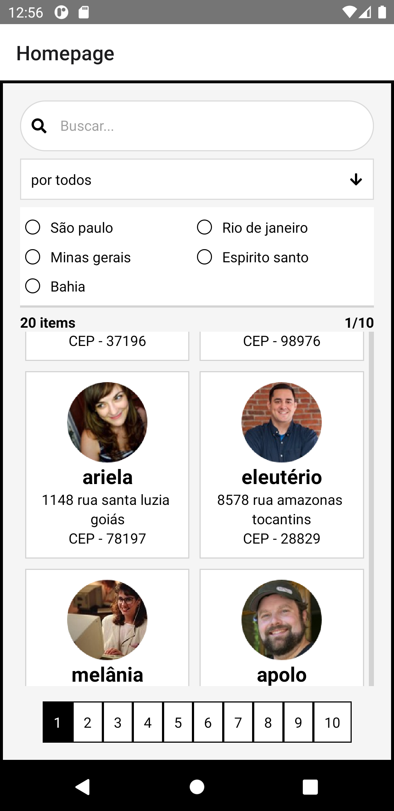

# react-native-juntossomosmais

 
 Baseado no challenge da juntos somos mais, programa feito com react native e typescript acompanhado do json-server para subir a api 
 
 Features: 
 -procurar no input 
 -paginação 
 -procurar por tipo 
 
 falta refaturar**
 
 

